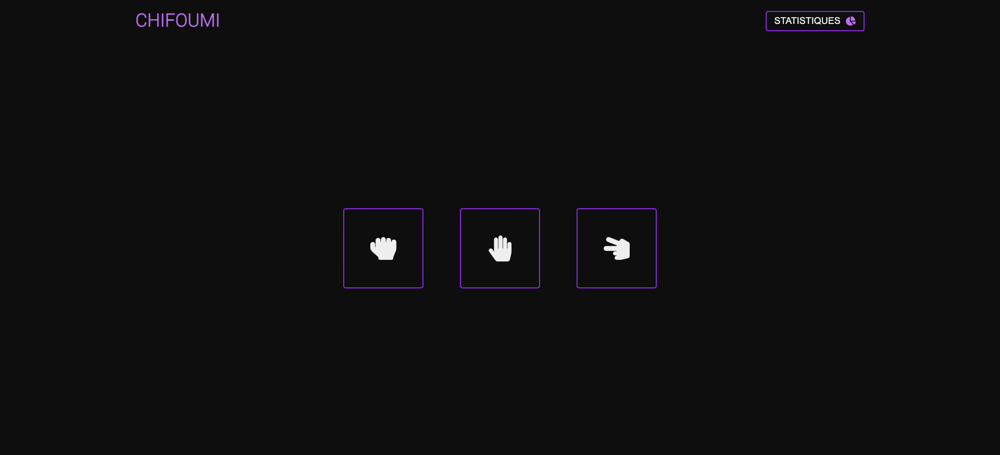
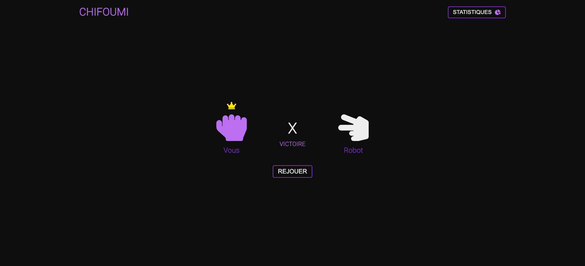
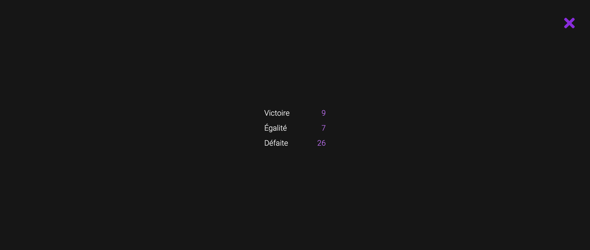

# Chifoumi

Réalisation du jeu 'Chifoumi' en html, sass & js.

## Voir le projet

Vous pouvez visualiser la page web via cette url [Jeu 'Chifoumi'](https://adrienlenoir.github.io/chifoumi/)

## Librairie / Toolkit
* [Fontawesome](https://fontawesome.com/) - Kit d'icône
* [Google Fonts](https://fonts.google.com/) - Fonts

## Auteurs
* **Adrien Lenoir** _alias_ [@AdrienLenoir](https://github.com/AdrienLenoir)

